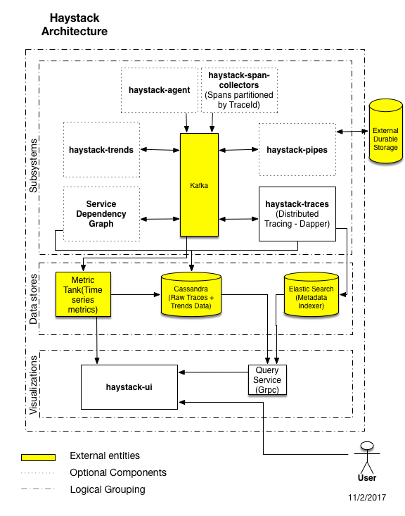

# haystack
Topmost level repository for public open source Haystack

## Overview
[Haystack](https://github.com/ExpediaDotCom/haystack) is an Expedia-backed open source project to facilitate detection 
and remediation of problems with enterprise-level web services and websites.

### The Problem
Modern websites rely on dozens or even hundreds of services to function. These services are often spread across many
platforms, data centers, and teams. Each service logs information. There are different types of logs (they can be 
categorized in different ways; the list below is one such way) 
1. Metrics (typically counts and durations), 
2. Application logs (interesting information emitted by the service, usually via log4j or a similar system)
3. Transaction logs (key/value pairs of significant events in the system)
4. Request/response logs (the XML, JSON, etc. sent to and from the service)

Haystack is intended to help users make sense of the information in these logs, particularly when things are not
working quite right (too slow, failing service calls, etc.): to find "the needle in the haystack" (thus the name).

### The Solution

Below find information about components in the block diagram above.

#### Infrastructure
The Haystack system includes an easy-to-use "one click" deployment mechanism, based on 
[Kubernetes](https://en.wikipedia.org/wiki/Kubernetes), that deploys a working development environment with working
implementations of all of the services in the block diagram above. This same mechanism, with different configurations, 
deploys to test and production environments as well. See the collection of scripts, CloudFormation templates, and YAML 
files in the [haystack-deployment](deployment/terraform) repository for details.

#### Kafka
Internal [Kafka](https://en.wikipedia.org/wiki/Apache_Kafka) is the Haystack message bus. The messages that enter the
Haystack system are [Span](https://github.com/ExpediaDotCom/haystack-idl/blob/master/proto/span.proto) objects in
[protobuf](https://en.wikipedia.org/wiki/Protocol_Buffers) format, and the modules below usually communicate with
each other via this message bus.

#### haystack-trends
The [haystack-trends](https://github.com/ExpediaDotCom/haystack-trends) module detects anomalies in metrics, based on 
user-defined "trend templates" that define the levels at which metrics should be considered "out of trend." A single 
anomalous metric does not necessarily merit alarming as out of trend, so the haystack-trends unit aggregates as directed
by the trend templates. For example, a particular service call might have a typical TP99 value of 100 milliseconds. 
("TP" means "top percentile" and TP99 refers to the minimum time under which 99% of the calls to the service have 
finished.) The trend template for such a service might declare that the TP99 metric is out of trend when it exceeds 150 
milliseconds, a value that was chosen to be low enough to notify interested parties of a potential problem before it 
becomes serious but high enough to minimize false positive alarms. The haystack-trends module stores its data in a Time 
Series Data Base (TSDB).

#### haystack-pipes
The [haystack-pipes](https://github.com/ExpediaDotCom/haystack-pipes) module delivers a human-friendly JSON version of 
Haystack spans to zero or more "durable" locations for more permanent storage. Current "plug in" candidates for such 
storage include:
* [Amazon Kinesis Firehose](https://aws.amazon.com/kinesis/firehose/) is an AWS service that facilitates loading 
streaming data into AWS. Note that its 
[PutRecordBatch API](http://docs.aws.amazon.com/firehose/latest/APIReference/API_PutRecordBatch.html) accepts up to
500 records, with a maximum size of 4 MB for each put request. The plug in will batch the records appropriately, to
minimize AWS costs. Kinesis Firehose can be configured to deliver the data to
    * [Amazon S3](https://aws.amazon.com/s3/)
    * [Amazon Redshift](https://aws.amazon.com/redshift/)
    * [Amazon Elasticsearch Service](https://aws.amazon.com/elasticsearch-service/)

#### Stitcher
The Stitcher module collects related Span objects into
[StitchedSpan](https://github.com/ExpediaDotCom/haystack-idl/blob/master/proto/stitchedSpan.proto) protobuf objects 
which are written to the Kafka message bus. The Span objects are identified as related by the parent span IDs; the Span
with a null parent Span ID is the root Span, child Spans have a parent Span ID of the root Span, grandchild Spans have a
parent span ID of the appropriate child Span, etc.

#### Spans
The Spans module writes Span objects into a persistent store. That persistent store consists of two pieces: the Span
data is stored in Cassandra, and the Span metadata is stored in ElasticSearch. Sampling, with the ability to force
storing a particular Span, will be available (under configuration) to keep the size of the Cassandra and ElasticSearch
stores reasonable, given the large volume of Span objects in a production system. 

#### Dependencies
The Dependencies module uses the parent/child relationships of Span objects to create dependency graphs for each
service, stored in a [Neo4j](https://en.wikipedia.org/wiki/Neo4j) graph database.

#### haystack-ui
The [haystack-ui](https://github.com/ExpediaDotCom/haystack-ui) (User Interface) module exposes (through a website) the
Spans, Stitched Spans, haystack-trends, and Dependencies created by the other modules. To simplify the API from the 
haystack-ui module to the Span databases, a small Query module bundles the data from the Cassandra store with the
metadata from the ElasticSearch store.
