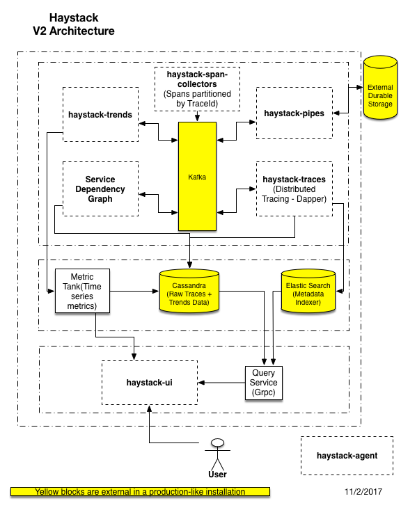

# 

## Introduction

[Haystack](https://github.com/ExpediaDotCom/haystack) is an Expedia-backed open source project to facilitate detection
and remediation of problems with enterprise-level web services and websites.

### The Problem
Modern websites rely on dozens or even hundreds of services to function. These services are often spread across many
platforms, data centers, and teams. Each service logs information. There are different types of logs (they can be
categorized in different ways; the list below is one such way)
1. Metrics (typically counts and durations),
2. Application logs (interesting information emitted by the service, usually via log4j or a similar system)
3. Transaction logs (key/value pairs of significant events in the system)
4. Request/response logs (the XML, JSON, etc. sent to and from the service)

Haystack is intended to help users make sense of the information in these logs, particularly when things are not
working quite right (too slow, failing service calls, etc.): to find "the needle in the haystack" (thus the name).

### The Solution

 
[Information about components in the block diagram above](infrastructure/section.md)
