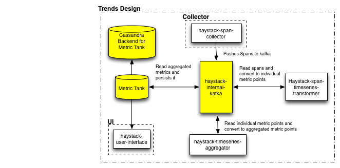

# Haystack Trends

The trends subsystem is responsible for reading the spans and generating the vital service health trends.

## Why Trends?

Haystack collects all the data from the various services and creates the distributed call graph and depicts the time taken by that call across various services.
This information can be hard to make sense of unless we have a trend to compare this against. Trends help us in the comparision and also provides the data source for the subsequent anomaly detection system which intends to find out anomalies in service health and trigger alerts

## What do we Trend

We currently  compute four trends for each combination of `service` and `operation` contained in the [span](https://github.com/ExpediaDotCom/haystack-idl/blob/master/proto/span.proto) pushed to haystack.

1. total_count `[count]`
2. success_count `[count]`
3. failure_count `[count]`
4. duration `[mean, median, std-dev, 99 percentile, 95 percentile]`

Each trend is computed for 4 intervals `[1min, 5min, 15min, 1hour]`.

## Architecture

The trend service is also a loosely coupled system and it uses kafka as its backbone. It is a collection of modules which reads spans and pushes aggregated metric points to kafka, each module runs as individual apps and talk to each other via kafka.
    
* [span-timeseries-transformer](https://github.com/ExpediaDotCom/haystack-trends/tree/master/span-timeseries-transformer) - this app is responsible 
for reading spans, converting them to metric points and pushing raw metric points to kafka partitioned by metric-key

* [timeseries-aggregator](https://github.com/ExpediaDotCom/haystack-trends/tree/master/timeseries-aggregator) - this app is responsible 
for reading metric points, aggregating them based on rules and pushing the aggregated metric points to kafka

The timeseries metric points are metrictank complient and can be directly consumed by metrictank. 

### Extensions
 
 1. Trends - Other than the four default trends more trends can be computed by adding a [transformer](https://github.com/ExpediaDotCom/haystack-trends/tree/master/span-timeseries-transformer/src/main/scala/com/expedia/www/haystack/metricpoints/transformer)
to create the metric point and adding an [aggregation-rule](https://github.com/ExpediaDotCom/haystack-trends/tree/master/timeseries-aggregator/src/main/scala/com/expedia/www/haystack/metricpoints/aggregation/rules) for it. 

 2. TimeSeries Database - Haystack supports metrictank as its timeseries store as default. In case you use another timeseries database one can just write another [adapter](https://github.com/ExpediaDotCom/haystack-trends/blob/master/commons/src/main/scala/com/expedia/www/haystack/trends/commons/serde/metricpoint/MetricTankSerde.scala) and configure trends to use it.

