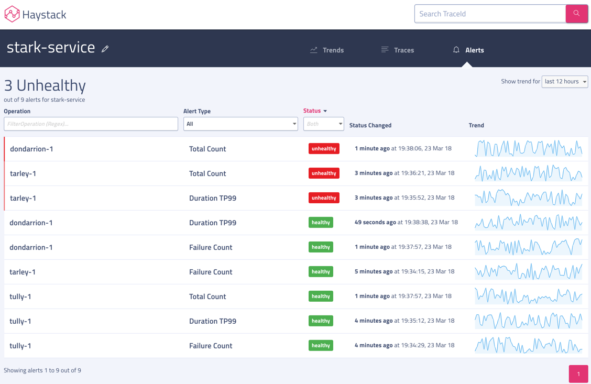
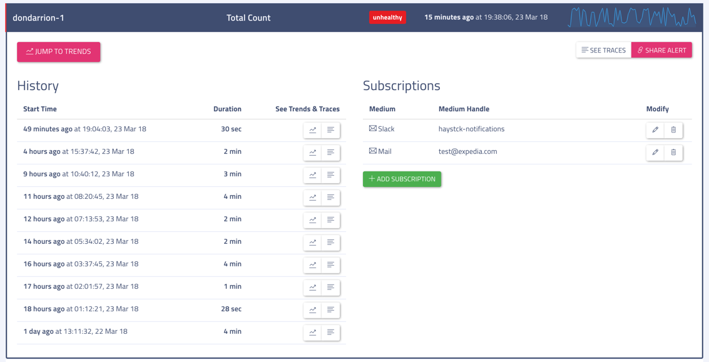

# Alerts

Visualization for current status of vital service health trends. Haystack provides anomaly detection on 3 metrices for each operation of all services - count, duration TP99 and failure count.

### Alerts Summary
You would get summary stats for count, duration TP99 and failure count alerts for all operation of the service on landing on Alerts page.
At the top, Current health of Service is displayed by total number of unhealthy alerts out of total available alerts.

Columns for OperationName, Alert Type, Status and Status Changed are sortable. Also, you can easily apply filter on OperationName, Alert Type and Status columns to quickly narrow down the desired operations you are looking for. You can change the duration of trend column by changing `Show trends for` dropdown.

### Alert Details 
History and Subscriptions of selected alert.

Here are some details on controls in Alert Details view -
- **Navigation to other views** - Jump to Trends and see traces helps in quickly navigating to trends or viewing traces for selected operation.
- **History** - History provides a summary of recently detected anomalies for selected Alert Type with options to explore trends and traces for unhealthy duration.
- **Subscriptions** - Displays all available subscriptions and allows user to create/edit subscriptions.

Also, you can get sharable link for an alert by clicking on `Share Alert`. 
