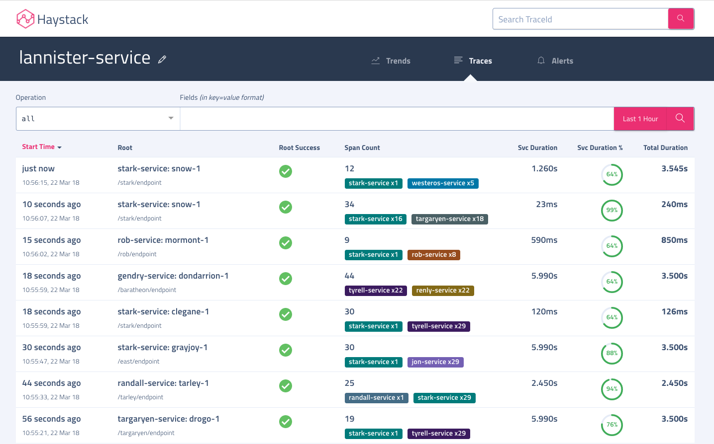

# Traces 

Visualization for tracing sub-system of Haystack.

### Traces Search  
User can search for Traces going through a service. Operation can be 'all' or any specific operation from the given service. Any fields you want to filter on can be specified `key=value` format. Time Picker allows selecting presets and any time range you want. 
Here are the available search options -
- **Service**: Service through which trace must go through
- **Operation**: Operation of the given service through which trace must go through
- **Tags**: User can specify white space separated list of tags in `key=value` format(eg. `success=false`), it will fetch Traces who have all the specified tags for provided service and operation combination. Please note that *only the tags whitelisted in haystack tracing subsystem will be eligible for search*, others will be ignored. Some special case for Tags search -
    - In case of `traceId` tag search, haystack will search for the given id across all services and ignore the provided service 
    - You can provide `minDuration=<x_milliseconds>` for searching for traces who took > x_milliseconds in total.
- **Time Range Picker**: User can select any presets or specify a custom time window.

Search results are presented in tabluar format for easy visualization of the data. All the columns are sortable. Here are details about how each column in search results is calculated -
- **Start Time** - Start time of the first span in local timezone.
- **Root** - Operation name of the root span, root span(aka. loopback span) is the first span where user request started. Second line provides the URL(from span.tags.url in trace).
- **Success** - Status of trace. Is marked failure if any spans in trace have success marked as false.
- **Spans** - Total number of spans across all services in the trace. Second line shows upto top two services based on count in the trace.
- **Op Duration** - Total duration for the queried operation. Sum of duration of all spans of the queried operation.
- **Op Duration %** - Percentage of total duration for the queried operation as compared to duration of the trace. Could be > 100% if there are parallel calls.
- **Svc Duration** - Total duration for the queried service. Sum of duration of all spans of the queried service
- **Svc Duration %** - Percentage of total duration for the queried service as compared to duration of the trace. Could be > 100% if there are parallel calls.
- **Total Duration** - Duration of the span. It is the difference between the start time of earliest operation and the end time of last operation in the trace

  
### Trace Details
Along with Timeline representation of a trace, haystack comes with 2 more sub-views for providing different prospectives on a trace.

#### Timeline
Waterfall for the trace, it shows span timelines using horizontal bars and parent child relationship between them using dotted lines.

You can see more details about an individual span like Logs and Tags for that span and raw spans by clicking on the span. Also, clicking on `Share Trace` copies a sharable persistent link for the trace.

#### Latency Cost
Latency cost view is a handy tool to analyze how much time a trace is consuming in network and if it there are cross datacenter calls involved. Nodes in this call graph represent a service in a datacenter. Edges represent network calls, edge value is network latency for the call(or average network latency if there were multiple calls between services). Red edges mark cross region network calls.

#### Trends
Trace-Trends view is simply list of all operations involved in a single trace along with their current count, duration & success trends. One quickly compare involved trends and spot if any of these trends have changed recently causing issue with the trace.

