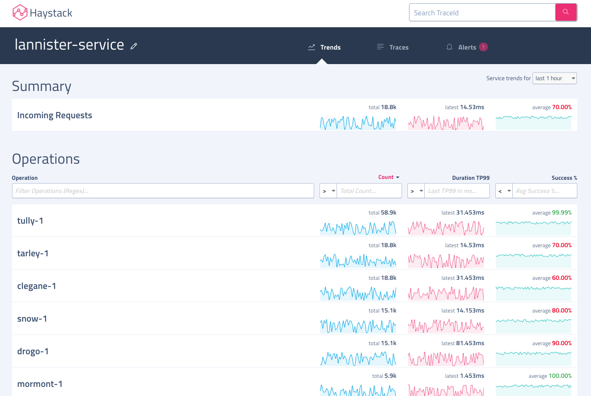
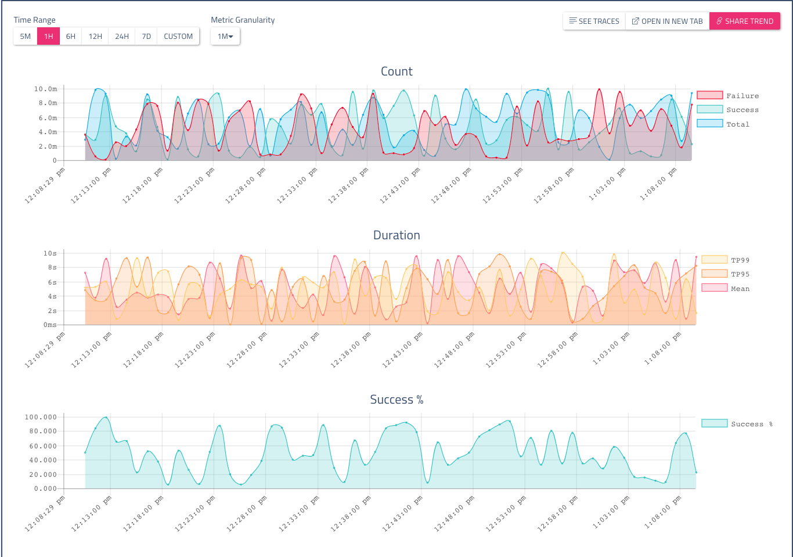

# Trends

The Trends view in the UI provides visualization for vital service health trends. Haystack trends 3 metrics for each operation of all services - count, duration(tp95, tp99, median) and success %.

## Main view
When you open the Trends page in the UI, the Trends view shows summary stats for count, duration and success % for all operations.

All 3 columns are sortable. You can change the duration for which you want summaries by changing the `Showing summary for` dropdown.

## Detail view 
When you choose to show details for one operation by clicking on the operation name, the Trend Details view shows graphs for count, duration and success % trends. 

Use these controls in the Trend Details view:

* Select one of the `Time Range` buttons to set a time range for the display. By default, the same time range is used as was used for the summary view you clicked to view details. You can change the range to any preset value, or to a custom time range.
* Select the granularity of the data in the graphs by choosing from the `Metric Granularity` dropdown. By default, we select a reasonable granularity based on time range duration. You can change it to any available granularity ie. 1min, 5min, 15min.
* The `Share Trend` button puts a link to the current detail view on the clipboard.

