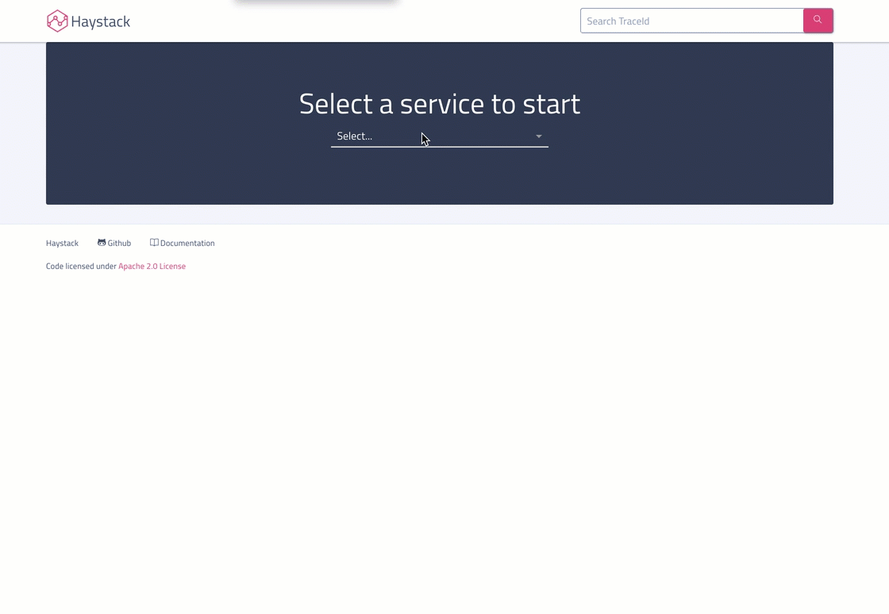

#  UI
The `haystack-ui` project is the web UI for haystack. It is the central place for visualizing processed data from various haystack sub-systems. 

Visualization tools in haystack-ui include -
* **Traces** - Distributed tracing visualization for easy root cause analysis 
* **Trends** - Visualization for vital service trends 
* **Service Dependency** [coming soon] - Real time dependency graph with health and connectivity indicators 
* **Alerts and Anomaly Detection** [coming soon] - UI for configuring and subscribing alerts 

Navigation in `haystack-ui` is pivoted around services. On selecting a service, you will get various visualizations tools each corresponding to a haystack sub-system. 

## Code, Deployment and Configuration
Refer the source repo - [https://github.com/ExpediaDotCom/haystack-ui](https://github.com/ExpediaDotCom/haystack-ui)

