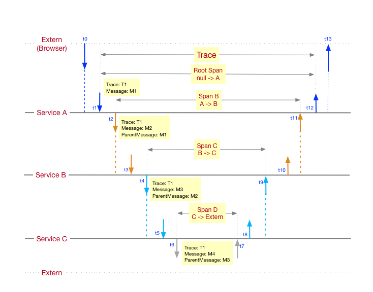
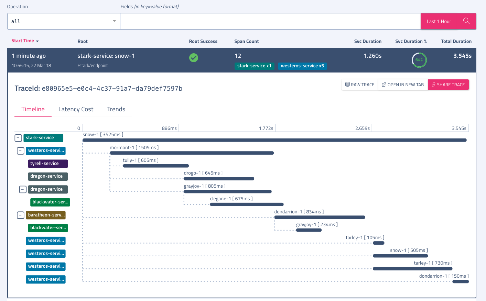

# Haystack Traces

Traces is a subsystem included in Haystack that provides a distributed tracing system to troubleshoot the problems in microservice architectures. Its design is based on the [Google Dapper](http://research.google.com/pubs/pub36356.html) paper.

### Why Traces?
In a modern microservice architecture, requests often span multiple services. Each service handles a request by performing one or more operations, e.g. invoke downstream services over http/grpc, query databases, publish to event bus, etc. To understand the behaviour and troubleshoot the problems esp. at the time of outages in a system that deploys tens or hundreds of microservices is a quite complex task. The application level monitoring and the numerous scattered log entries may not be useful enough to detect a problem. 

Haystack Traces subsystem solves this problem by reading the [spans](https://github.com/ExpediaDotCom/haystack-idl/blob/master/proto/span.proto) emitted by microservices and stitching them together based on various IDs associated with a span namely SpanID, ParentSpanId and TraceId. We will talk more about these IDs in our next section. Traces subsystem also provides a search on the metadata attached with every span and presents a view showing all the services and their operations as a time vector. This helps a developer or system administrator to understand the flow of calls and diagnose latencies across the services.  

#### Example flow
Following is a typical flow of a single request that starts from the browser or a mobile app. It shows how a request typically flows across multiple services, and at each point of communication, a span is generated. In this diagram, T1 is used as TraceID that is generated once at the very start for every single incoming request. Message IDs - M1, M2 are SpanIds that are generated for every single interaction between two services. MessageIDs becomes the ParentMessageId (aka ParentSpanId) by the callee service e.g. Service B when it calls its own downstream servics e.g. Service C

### Architecture
The traces subsystem comprises of following components:

- **Indexer**: The role of 'indexer' is to read the spans from kafka and group them together based on span's unique traceId. It finally writes this [grouped data structure](https://github.com/ExpediaDotCom/haystack-idl/blob/master/proto/spanBuffer.proto) to Cassandra and ElasticSearch. Cassandra is used as a raw data store where all the spans are inserted with TraceId as a primary key. ElasticSearch is used to build an index on the metadata, serviceName and operationName associated with every span. This helps the 'reader' service to query elasticsearch for any contextual search e.g. fetch all TraceId(requests) that have any span with `serviceName=xyz` and a metadata tag `success=false`. 

The 'indexer' groups the spans together in-memory for every traceId with a purpose. Besides storing them in Cassandra and ElasticSearch, they are also published to a different kafka topic that may help solving newer usecases in future with this enriched data.  

The indexer also controls the attributes to be indexed throught a whitelist configuration. The indexer reads the whitelist from external store and applies them dynamically. The goal is to help organizations in protecting and scaling their infrastructure esp. ElasticSearch more proactively. 

- **Reader**: The reader runs as a grpc server and serves Haystack UI to fetch traces directly from Cassandra for a TraceId or use ElasticSearch for contextual searches. For a search, the 'reader' component queries ElasticSearch that responds with a set of TraceIds. It then pulls all spans from Cassandra for every unique TraceId. The reader applies following transformations on the spans associated with a TraceId to build a complete representation.
     - TraceValidation: Validates if required fields in the span exist, for e.g. serviceName, operationName. Only one span ie root span has ParentMessageId as `null`
     - Partial Span Merge: Indexer component may miss grouping all spans together for every TraceID in one go and can spit multiple span-groups. This can happen due to an outage or the in-memory cache of indexer forcing an early eviction and many more. This transformer takes care of merging them correctly.
     - Deduplication: Duplicate span can exist due to kafka at-least once guarantees, hence this transformer removes the duplicates with same SpanID    
     - ClockSkew: This fixes the clock skew between parent and child span. If any child span reports a startTime earlier then parent span's startTime, corresponding delta gets added in the subtree with child span as root. We are evaluating better strategies to fix the clock skew problem in a distributed system.
     
The UI finally reads the  stitched view of all the spans and renders it as following for a given TraceID.

