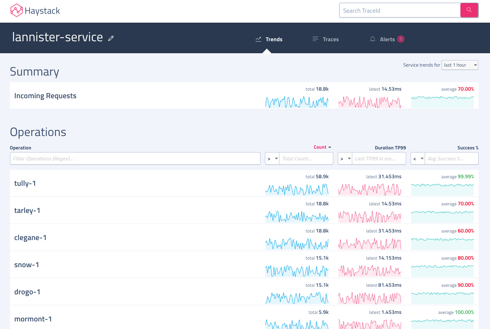

# Trends
Visualization for vital service health trends. Haystack trends 3 metrices for each operation of all services - count, duration(tp95, tp99, median) and success %.

## Operation Summary

You would get summary stats for count, duration and success % for all operation of the service on landing on Trends page. All 3 columns are sortable. You can change the duration for which you want summaries by changing `Showing summary for` dropdown.

## Operation Trend Details 

Graphs for count, duraiton and success % trends. Here are some details on controls in Trend Details view -
- **Time Range** - By default the same time range as used for summary. You can change it to any preset or custom time range.
- **Metric Granularity** - By default, we select a reasonable granularity based on time range duration. You can change it to any available granularity ie. 1min, 5min, 15min.
