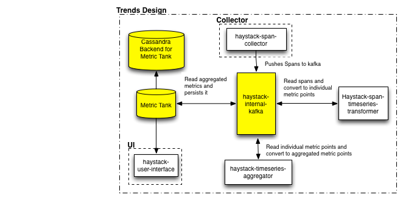

[](https://travis-ci.org/ExpediaDotCom/haystack-trends)
[](https://codecov.io/gh/ExpediaDotCom/haystack-trends)

# Haystack Trends

haystack-trends contains the required modules for trending the spans pushed to haystack. We currently plan to compute three trends for each 
combination `service_name` and `operation_name` contained in the spans (refer to the [span schema](https://github.com/ExpediaDotCom/haystack-idl/blob/master/proto/span.proto) for details of the fields in the span  )

1. success_count `[1min, 5min, 15min, 1hour]`
2. failure_count `[1min, 5min, 15min, 1hour]`
3. duration `[mean, median, std-dev, 99 percentile, 95 percentile]`

> *Note:* If an error tag is present and has a value of true, then the span will be treated as a failure. In all other scenarios, it will be treated as a success. 

More trends can be computed by adding a [transformer](https://github.com/ExpediaDotCom/haystack-trends/tree/master/span-timeseries-transformer/src/main/scala/com/expedia/www/haystack/trends/transformer)
to create the metric point and adding an [aggregation-rule](https://github.com/ExpediaDotCom/haystack-trends/tree/master/timeseries-aggregator/src/main/scala/com/expedia/www/haystack/trends/aggregation/rules) for it

## Required Reading
 
In order to understand the haystack-trends one must be familiar with the [haystack](https://github.com/ExpediaDotCom/haystack) project. Its written in kafka-streams(http://docs.confluent.io/current/streams/index.html) 
and hence some prior knowledge of kafka-streams would be useful. 
 
## Technical Details



Haystack trends is a collection of modules which reads spans and pushes aggregated metric points to kafka, each module runs as individual apps and talk to each other via kafka.
    
* [span-timeseries-transformer](https://github.com/ExpediaDotCom/haystack-trends/tree/master/span-timeseries-transformer) - this app is responsible 
for reading spans, converting them to metric points and pushing raw metric points to kafka partitioned by metric-key

* [timeseries-aggregator](https://github.com/ExpediaDotCom/haystack-trends/tree/master/timeseries-aggregator) - this app is responsible 
for reading metric points, aggregating them based on rules and pushing the aggregated metric points to kafka

The timeseries metric points are metrictank complient and can be directly consumed by [metrictank](https://github.com/grafana/metrictank), one can write their own serde if they want to push the metrics out in some other timeseries format.

Sample [MetricPoint](https://github.com/ExpediaDotCom/haystack-trends/blob/master/commons/src/main/scala/com/expedia/www/haystack/trends/commons/entities/MetricPoint.scala) : 
```json
{
	"type": "count",
	"metric": "duration",
	"tags": {
		"client": "expweb",
		"operationName": "getOffers"
	},
	"epochTimeInSeconds": 1492641000,
	"value": 420.02
}
```
 
The raw and aggregated metric points are of the same json schema but are pushed to different kafka topics

## Building

#### Prerequisite: 

* Make sure you have Java 1.8
* Make sure you have docker 1.13 or higher

#### Build

You can choose to build the individual subdirectories if you're working on any specific sub-app but in case you are making changes to the contract 
such as span or metric point which would effect multiple modules you should run

```
make all
```
This would build all the individual apps and including unit tests, jar + docker image build and run integration tests for haystack-trends.


#### Integration Test

If you are developing and just want to run integration tests 
```
make integration_test

```
