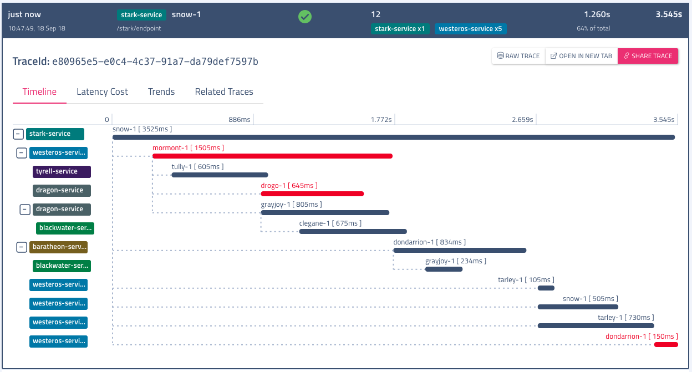
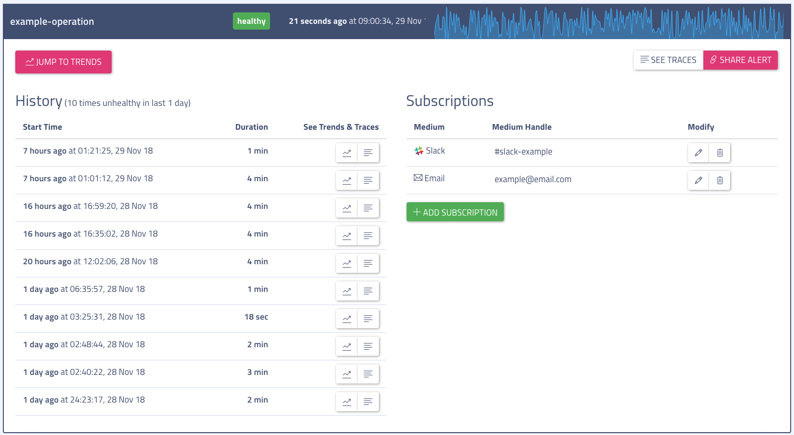

[](https://travis-ci.org/ExpediaDotCom/haystack-ui)
[](https://coveralls.io/github/ExpediaDotCom/haystack-ui?branch=master&service=github)


# Haystack-UI

Haystack-ui is the web UI for haystack. It is the central place for visualizing processed data from various haystack sub-systems.
Visualization tools in haystack-ui include -

|                             Traces                             |
| :------------------------------------------------------------: |
| Distributed tracing visualization for easy root cause analysis |
|    |

|                        Trends                         |
| :---------------------------------------------------: |
| Visualization of vital service and operation trending |
|           |

|                           Service Graph                            |
| :----------------------------------------------------------------: |
| Real time dependency graph with health and connectivity indicators |
|          |

|               Alerts and Anomaly Detection                |
| :-------------------------------------------------------: |
| UI for displaying, configuring, and subscribing to alerts |
|               |

|                         Universal Search                         |
| :--------------------------------------------------------------: |
|     Intuitive, sandbox-style searching for accurate results.     |
|  |

## Development

It is a expressjs based single page client side app written in ES6 + React and using Mobx for data flow.

### Pre-requisites

Ensure you have `node >= 10.0` and `npm >= 6.0` installed.

Clone the repository including recursive submodules:

```
$ git clone --recurse-submodules https://github.com/ExpediaDotCom/haystack-ui.git
$ cd haystack-ui
```

If the repository was already cloned, you can initialize and update submodules with `git submodule update --init --recursive`

### Build and Run

This application uses [webpack](https://webpack.github.io/) for building + bundling resources. To run in developer mode with client and server side hotloading, use:

```
$ npm install                # install dependencies
$ npm run start:dev          # start server in dev mode with hotloading
```

Once start is successful you can visit [http://localhost:8080/](http://localhost:8080/)

For running in production mode, use:

```
$ npm install                # install dependencies
$ npm run build              # run tests(with coverage), build client side code and emit produciton optimized bundles
$ npm start                  # start node server
```

#### Autoformatting in your favorite IDE with Prettier Integration

This projects supports auto-formatting of source code! Simply find your favorite IDE from the list in the following list: https://prettier.io/docs/en/editors.html

For VSCode support, perform the following steps:

-   Launch VS Code Quick Open (Ctrl+P)
-   Paste the following command, and press enter:

```
ext install esbenp.prettier-vscode
```

This projects has a pre-configured `.vscode/settings.json` which enables format on save. Auto-formatting should execute everytime you save a file.

Prettier is also configured to run in a pre-commit hook to make enforcing consistency of source code between developers easy.

## Testing

Haystack-ui utilizes [Mocha](https://github.com/mochajs/mocha) as it's testing framework, with [Chai](https://github.com/chaijs/chai) as the assertation library, [Enzyme](https://github.com/airbnb/enzyme) for utility, and [JSDOM](https://github.com/tmpvar/jsdom) as a headless browser for rendering React components.
[ESLint](https://github.com/eslint/eslint) is used as a linter and insurance of code quality.

To run the test suite, enter the command `npm test`.

To check code coverage, run `npm run coverage` and open the generated index.html in the created coverage folder

**Note**-
You may have to install Cairo dependencies separately for tests to work.

-   **OS X Users** : `brew install pkg-config cairo pango libpng jpeg giflib`
    -   _NOTE_: If you run into `Package libffi was not found in the pkg-config search path.` errors while running `npm install`, you will need to addtionally run the following command: `export PKG_CONFIG_PATH="${PKG_CONFIG_PATH}:/usr/local/opt/libffi/lib/pkgconfig"`
-   **Others**: Refer [https://www.npmjs.com/package/canvas#installation](https://www.npmjs.com/package/canvas#installation)

### Docker

We have provided `make` commands to facilitate building. For creating docker image use -

```
$ make all

```

## Configuration

Haystack UI can be configured to use one or more stores, each providing user interface for one subsystem in Haystack. Based on what subsystems you have available in your haystack cluster, you can configure corresponding stores and UI will adapt to show interfaces only for the configured subsystems.
For more details on this refer - [https://github.com/ExpediaDotCom/haystack-ui/wiki/Configuring-Subsystem-Connectors](https://github.com/ExpediaDotCom/haystack-ui/wiki/Configuring-Subsystem-Stores)

## Haystack-ui as drop-in replacement for Zipkin UI

If you have an existing zipkin cluster you can use haystack UI as a drop-in replacement for zipkin's UI.
For more details on this refer - [https://github.com/ExpediaDotCom/haystack-ui/wiki/Configuring-Subsystem-Connectors#using-haystack-ui-as-replacement-for-zipkin-ui](https://github.com/ExpediaDotCom/haystack-ui/wiki/Configuring-Subsystem-Connectors#using-haystack-ui-as-replacement-for-zipkin-ui)
